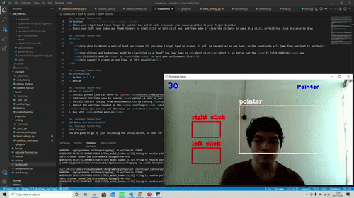
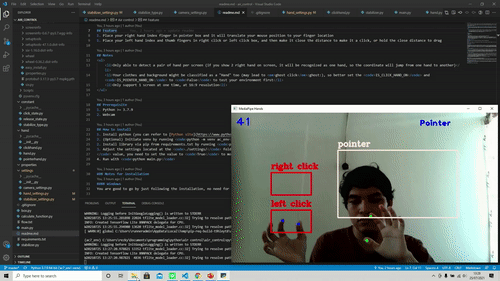
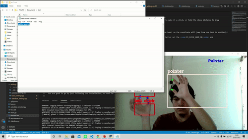
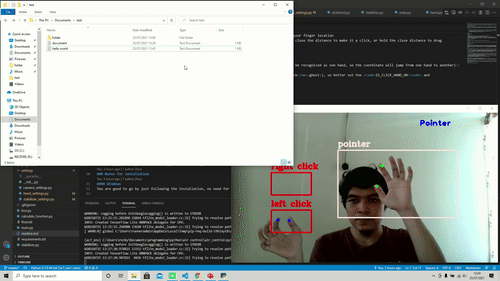

# Air control

Create a virtual mouse using webcam, google [MediaPipe](https://github.com/google/mediapipe), python [mouse](https://github.com/boppreh/mouse) and openCV in python 

<b>Before testing the virtual mouse, make sure you have saved and closed your important programs, the <em>ghost click</em>:ghost: can be very dangerous, use with full caution:exclamation::shipit:</b>

## Feature
1. Place right hand index finger in pointer box and it will translate your mouse position to your finger location 
1. Place left hand index and thumb fingers left click box, and then make it close the distance and release it to do a left click, do it twice to double left click 
1. Place left hand index and thumb fingers right click box, and then make it close the distance and release it to do a right click 
1. Place left hand index and thumb finger in left or right click box, and then make it close the distance and hold it to do a mouse drag, and release the hold it to drop

## Notes
<ul>
    <li>Only able to detect a pair of hand per screen (if you show 2 right hand on screen, it will be recognized as one hand, so the coordinate will jump from one hand to another)</li>
    <li>Your clothes and background might be classified as a "Hand" too (may lead to <em>ghost click</em>:ghost:), so better set the <code>IS_CLICK_HAND_ON</code> and <code>IS_POINTER_HAND_ON</code> to <code>False</code> to test your environment first</li>
    <li>Only support 1 screen at one time, at 16:9 resolution<li>
</ul>

## Prerequisite
1. Python >= 3.7.9
2. Webcam

## How to install
1. Install python (you can refer to [Python site](https://www.python.org/downloads/))
2. (Optional) Initiate venv by running <code>python -m venv ac_env</code>
2. Install library via pip from requirements.txt by running <code>python -m pip install requirements.txt</code>
3. Adjust the settings located at the <code>./settings/</code> folder (the <code>IS_CLICK_HAND_ON</code> and <code>IS_POINTER_HAND_ON
</code> value, you need to set the value to <code>True</code> to move your mouse, or keep it to <code>False</code> if you want to check for <em>ghost click</em> first)
4. Run with <code>python main.py</code>

### Notes for installation
#### Windows
You are good to go by just following the installation, no need for additional works

#### Linux
Makesure to use <b>XOrg</b> for the display server (Ubuntu 21.04 use wayland, you need to change it first) to enable the mouse library

#### Other OS (Including Mac)
Not yet tested

## Stabilizer
Because the MediaPipe usually return unstable coordinate of a finger tip, and mouse is usually used with high stability, a stabilizer function is needed. This project have 4 options of stabilizers, you can choose which one you want to use and other value in <code>./settings/stabilizer_settings.py</code>. The stabilizer function will have 3 input parameter, the <code>finger_tip_x</code> and <code>finger_tip_y</code> list with <code>MINIMUM_TIP_POINT_TO_CALCULATE_CENTROID</code> numbers of points, and <code>last_position</code> (the last tip coordinate). <code>finger_tip_x</code> and <code>finger_tip_y</code> list use FIFO mechanism to save value, updated each frame, with maximum number of <code>MAX_TIP_POINTS</code> values.

### Calculate Centroid 1
This one is created to keep the persistance of the tip when the finger stopped, but keep it moving when finger moves

1. For the first <code>MINIMUM_TIP_POINT_TO_CALCULATE_CENTROID</code> coordinate, directly move to the current finger coordinate
2. If the <code>finger_tip_x</code> list already have <code>MINIMUM_TIP_POINT_TO_CALCULATE_CENTROID</code> number of coordinates, then calculate the centroid
3. Calculate the distance between next coordinate centroid and the last position coordinate (<code>last_position</code>) if the distance is above <code>MAXIMUM_CENTROID_1_DISTANCE</code>, then next coordinate is the centroid, else the next coordinate is same with last coordinate

### Calculate Centroid 2
This one is created to keep the persistance of the tip when the finger stopped, but keep it moving when the finger moves, faster than Calculate Centroid 1, but less persistance

1. For the first <code>MINIMUM_TIP_POINT_TO_CALCULATE_CENTROID</code> coordinate, directly move to the current finger coordinate
1. Calculate centroid from saved point in finger_tip_x and finger_tip_y list, except the last value (current finger position)
2. Calculate the distance between centroid and current finger coordinate
3. If the distance passthrough <code>MAXIMUM_CENTROID_2_DISTANCE</code>, then use the current finger coordinate as next coordinate, also refill all value in finger_tip_x and finger_tip_y with current finger coordinate
4. If the distance doesn't passthrough, then use the <code>last_position</code> value

### Smooth Move
Source : [Youtube video](https://youtu.be/01sAkU_NvOY?t=23678) 
Slowly move the point by dividing distance between last coordinate and current finger coordinate with <code>SMOOTHING_POINT</code>, and add it to the last coordinate so the next coordinate will not directly jump to the current finger coordinate, but slowly moving the point towards the current finger coordinate

### Smooth Move with Minimum Angle
Same with Smooth Move, but it will use the last two coordinate and current finger coordinate to calculate the angle between the three point, if it passthrough the <code>MINIMUM_TIP_POINT_TO_CALCULATE_ANGLE</code> then the Slow Move stabilizer calculated, else it will directly jump to the current finger coordinate

### No Stabilizer
Directly jump to current finger location